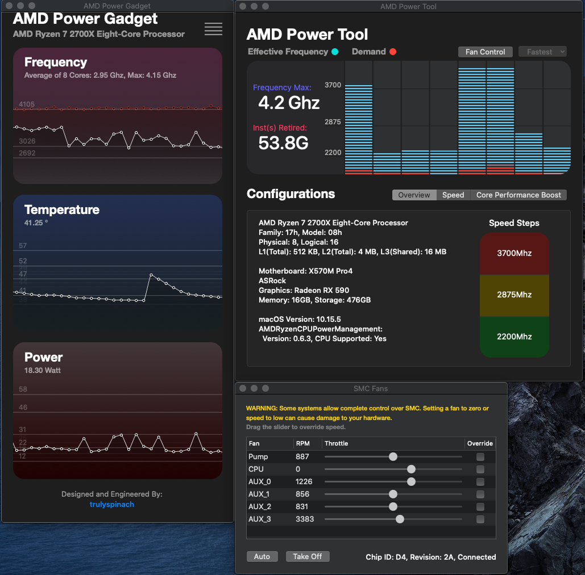
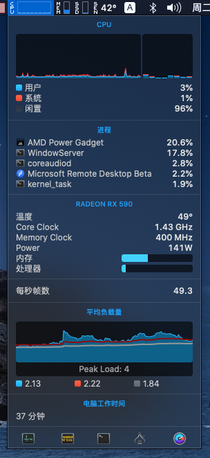
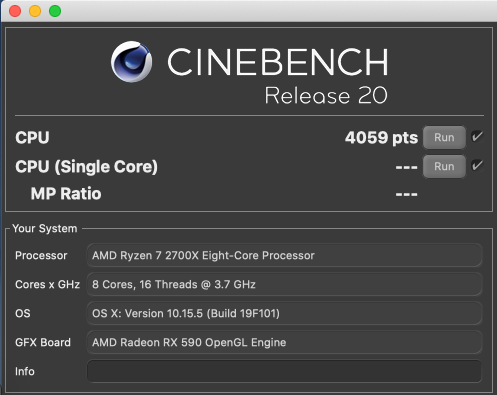
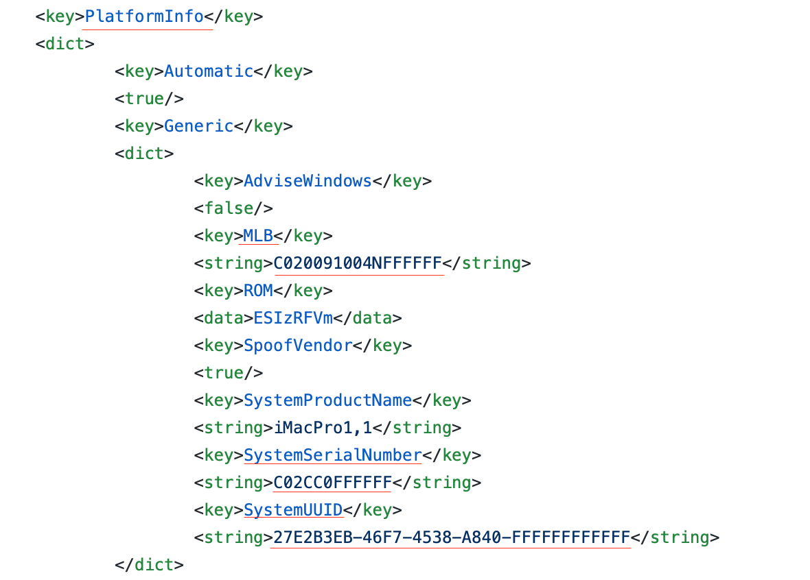

	mainboard: asrock x570m1
	CPU: Ryzen7 2700x
	GPU: AMD RX590
	SSD: NVME UNSPC512KMM
	Mem: 8G 3200 * 2
	MACOS: 10.15.5
	OPENCORE: 0.5.8
***
  
`MacOS`  
***
  
`AMDCPUPowerManager`  
***
  
`Istatmenu info`  
***
  
`CineBench R20`  
***
  Please `remember` to change `PlatformInfo` in config.plist  with [GenSMBIOS](https://github.com/corpnewt/GenSMBIOS)  
	  
	
	`MLB`  
	`SystemSerialNumber`  
	`SystemUUID`  
***
	Email:zhoujian78@sina.com
